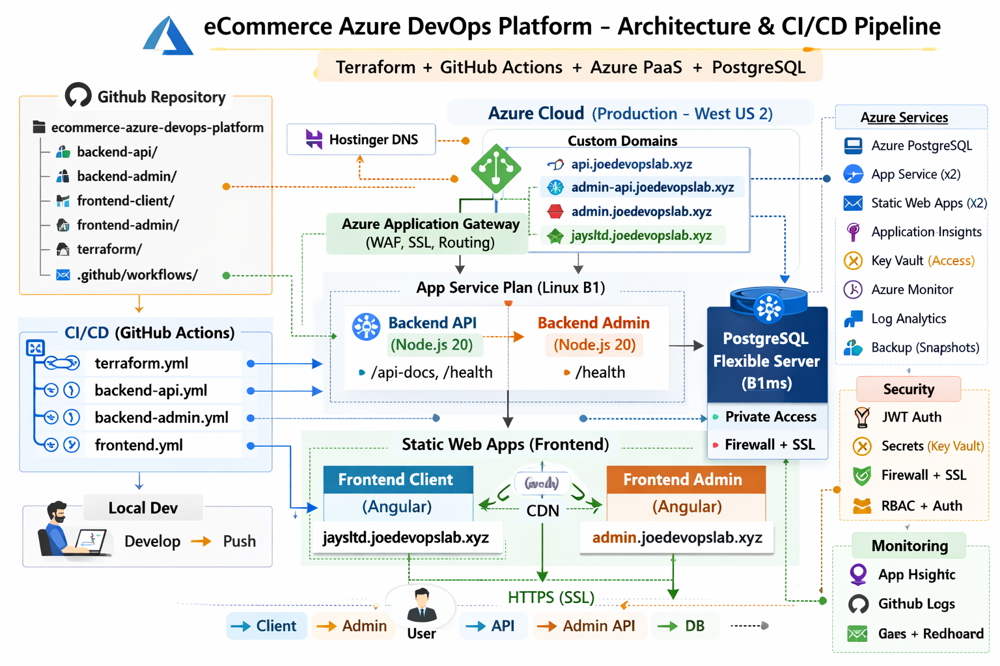
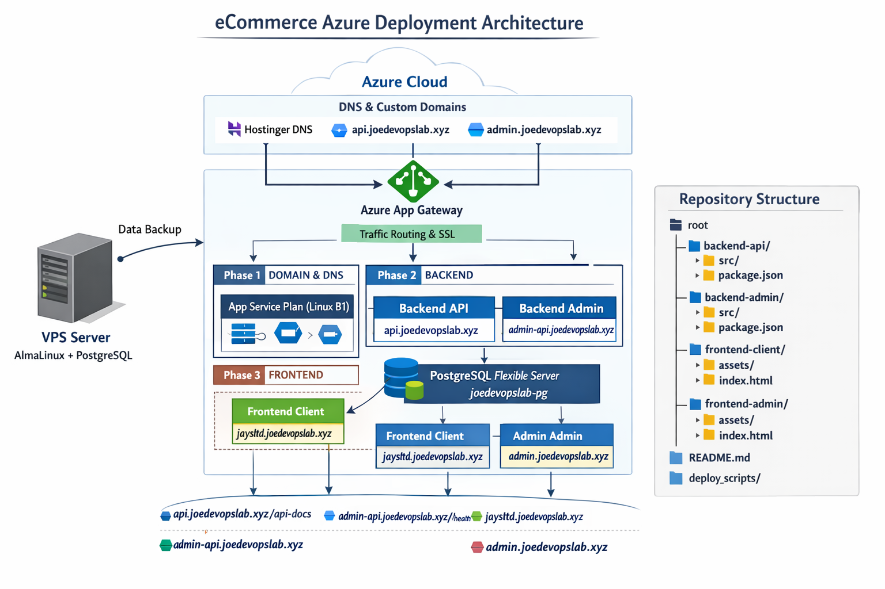
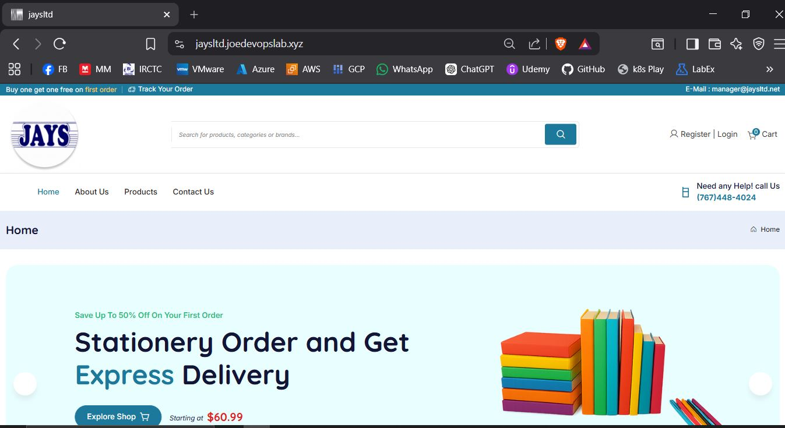
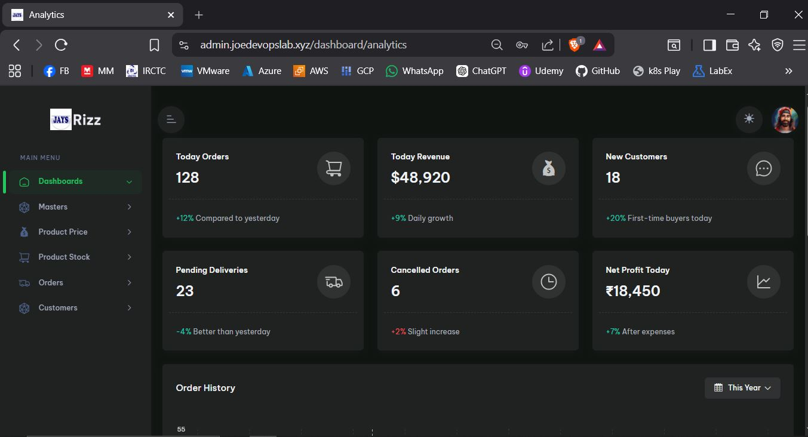

# 🚀 eCommerce Azure DevOps Platform


## 📌 Project Summary

This project demonstrates the migration of a production eCommerce application from a VPS (AlmaLinux + PostgreSQL) to Microsoft Azure PAAS architecture. 

## The architecture is built using :

- Infrastructure as Code (Terraform)
- CI/CD (GitHub Actions)
- Azure App Service
- Azure PostgreSQL Flexible Server
- Azure Static Web Apps
- Secure Secret Management

---

## 🏗 Architecture Overview

### ⚙️ Infrastructure as Code

- Terraform provisions:
- Resource Group
- App Service Plan (Linux B1)
- Backend API App Service
- Backend Admin App Service
- PostgreSQL Flexible Server
- Static Web Apps (Client & Admin)
- Application Insights
- Networking & Firewall rules

### 🔄 CI/CD Pipelines

- GitHub Actions handles:
- Terraform deployment
- Backend API deployment
- Backend Admin deployment
- Frontend deployment
- Health check validation

---

### 🏗 Final Production Architecture



### ☁ Migration Overview



---

Logical Flow
```
GitHub Repo
   ↓
GitHub Actions
   ↓
Terraform Apply (Infra Provisioning)
   ↓
Azure Resources
   ├── Resource Group
   ├── App Service Plan (Linux B1)
   ├── Backend API (Node 20)
   ├── Backend Admin (Node 20)
   ├── PostgreSQL Flexible Server
   ├── Static Web App (Client)
   ├── Static Web App (Admin)
   └── Application Insights

```
Runtime Flow
```
User
 ↓
Custom Domain (Hostinger DNS)
 ↓
Azure App Service / Static Web App
 ↓
Backend APIs
 ↓
PostgreSQL Flexible Server
```

---

### 🚀 How to Deploy

1️⃣ Provision Infrastructure
```
cd terraform/env/prod
terraform init
terraform apply
```
2️⃣ Push Code
```
git push origin main
```
GitHub Actions handles deployments.

---

### 🏗 Repository Structure

```
ecommerce-azure-devops-platform/
│
├── architecture/
│   ├── 01-migration-overview.png
│   ├── 02-azure-runtime-architecture.png
│   └── 03-ecommerce-azure-architecture.png
│
├── backend-api/                     # Source code
│   ├── src/
│   ├── package.json
│   ├── package-lock.json
│   └── README.md
│
├── backend-admin/
│   ├── src/
│   ├── package.json
│   ├── package-lock.json
│   ├── app.js
│   └── README.md
│
├── frontend-client/                  # Built Angular dist
│   ├── index.html
│   ├── assets/
│   ├── media/
│   ├── staticwebapp.config.json
│   └── README.md
│
├── frontend-admin/
│   ├── index.html
│   ├── assets/
│   ├── staticwebapp.config.json
│   └── README.md
│
├── terraform/                        # Infra as Code
│   ├── modules/
│   │   ├── resource-group/
│   │   ├── service-plan/
│   │   ├── web-app/
│   │   ├── postgres/
│   │   ├── static-web-app/
│   │   └── app-insights/
│   │
│   ├── env/
│   │   ├── dev/
│   │   │   ├── main.tf
│   │   │   ├── variables.tf
│   │   │   └── terraform.tfvars
│   │   └── prod/
│   │       ├── main.tf
│   │       ├── variables.tf
│   │       └── terraform.tfvars
│   │
│   ├── providers.tf
│   ├── backend.tf
│   └── variables.tf
│
├── .github/
│   └── workflows/
│       ├── terraform.yml
│       ├── backend-api.yml
│       ├── backend-admin.yml
│       ├── frontend-client.yml
│       └── frontend-admin.yml
│
├── screenshots/
│       ├── client-frontend.png
│       ├── admin-frontend.png
│       ├── backend-api.png
│       └── backend-admin.png
│
└── README.md

```

---

### 🗄 Database Migration Strategy

The original PostgreSQL database was hosted on a VPS (AlmaLinux).
As part of the cloud migration, the database was migrated to Azure using a secure dump-and-restore approach.

Migration Process
1. Generated backup from VPS-hosted PostgreSQL:
```
pg_dump -Fc -d EbookTest -f EbookTest.dump
```
2. Created Azure PostgreSQL Flexible Server instance.
3. Restored database securely using SSL:
```
pg_restore \
  -h <azure-server>.postgres.database.azure.com \
  -U postgres \
  -d EbookTest \
  --no-owner \
  --role=postgres \
  EbookTest.dump
```
4. Hardened network access:
- Removed VPS IP from firewall
- Enabled Azure services only
- Enforced SSL connections

####  Security Note
Database dump files are not stored in this repository.
Backups and runtime data are managed outside version control to maintain security and integrity.

---

### 🔐 Security Practices

- Environment variables stored securely
- JWT secret externalized
- PostgreSQL firewall rules restricted
- Production stack traces disabled
- HTTPS enforced

---

### 🧪 Validation Endpoints

Client-frontend


Admin-frontend


Backend-admin


Backend-api


Terraform Deploy


Backend API Deploy


Frontend Deploy


---

### 🧠 Why This Project Matters

This project reflects a real-world cloud migration scenario with production constraints including cost optimization, security hardening, and CI/CD automation.

It demonstrates the ability to:
- Design PaaS architectures
- Automate infrastructure
- Secure cloud workloads
- Implement CI/CD pipelines
- Manage production cloud environments

----

### 🔥 Future Enhancements 

- Use Docker + ACR
- Add deployment slots (Blue/Green)
- Private endpoint for PostgreSQL
- VNet integration
- Add cost estimation (Infracost)
- Add tfsec security scan in pipeline
